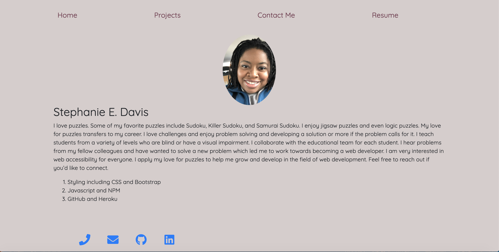
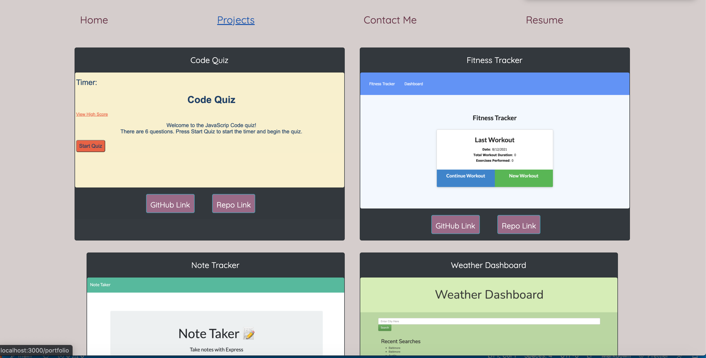
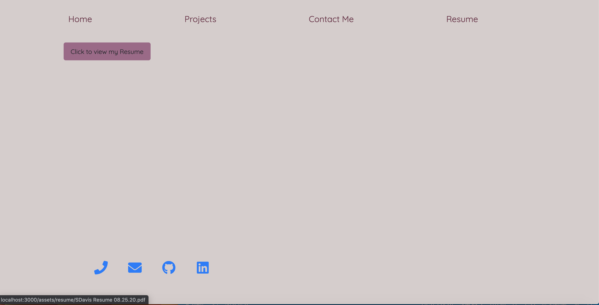
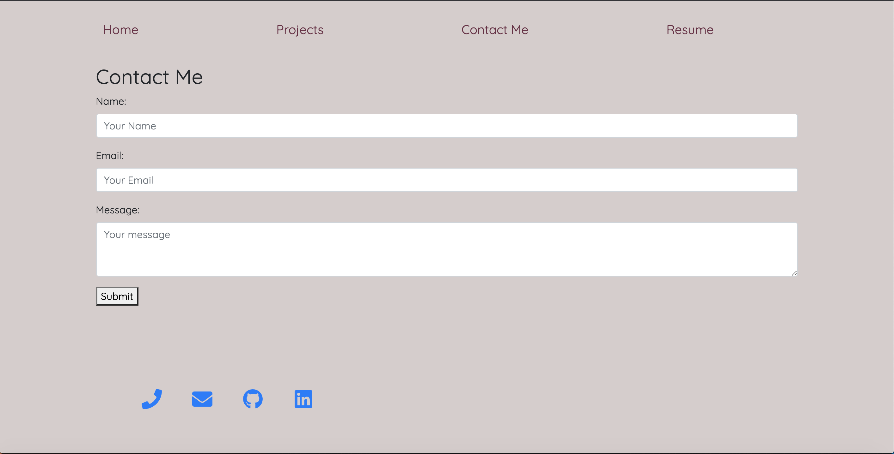
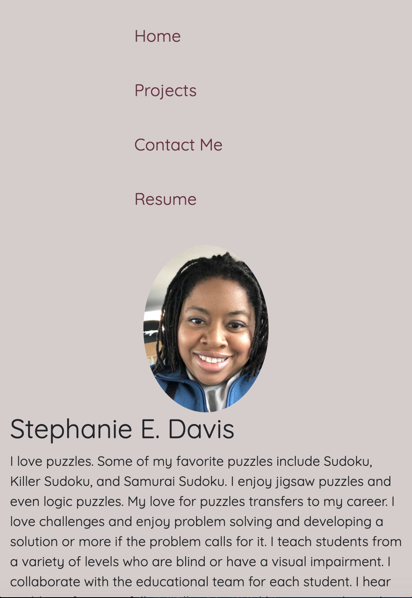

# React Portfolio

### Table of Contents
- [Description](#Description)
- [Link to Portfolio](#link-to-portfolio)
- [Technologies Used](#Technologies-Used)
- [Highlights](#highlights)
- [Screenshots](#screenshots)
- [Contributor](#contributor)
- [Sources](#sources)

## Description
This is my portfolio using React. There are image cards of deployed applications. There's a contact form. The bottom buttons are linked to my profiles as well my number and email.  

## Link to Portfolio
Here is the link to my portfolio. I hope you enjoy it!
[Stephanie's React Portfolio](https://whatawhat.github.io/react_portfolio/)

## Technologies Used
```
HTML
CSS
Bootstrap
React
```

## Highlights
There are several features to this portfolio that I'm very proud of. 

- I enjoyed making my photo rounded. I love the way it looks even though I wanted a thumbnail.

- In the contact me section, I was able to make the phone number a link. This will be very valuable when viewing from a cell phone or any device that allows the user to call immediately. This allows the viewer to tap the number and call.

- In the contact me section, I was able to link my email address so when clicked on it, the viewer will go to their default email application to send an email. 

- It was great using the favicons for the bottom of the page.


## Screenshots
This is the main screen for the full size view.


This is a view of the project cards in the full size view. 


This is the view of the resume page.  


This is the view of the contact form.


This is the mobile responsive version of the main page. 

## Contributor
- Stephanie Davis

## Questions
If you have any questions, please feel free to contact me. 
- GitHub: [whatawhat](www.github.com/whatawhat) to visit my repository
- Email: stephedavis12@gmail.com

